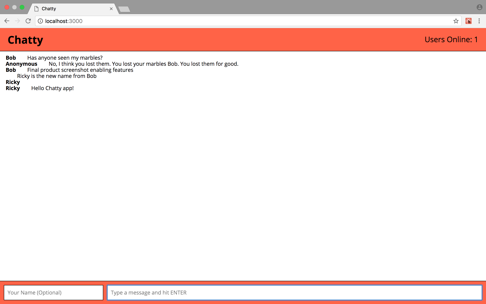
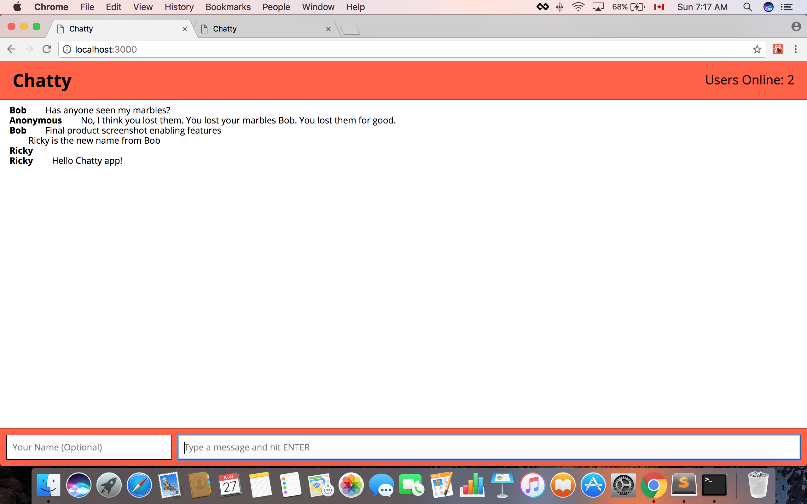

Chatty App
=====================

A single page, chatroom web app.
Project intended for Lighthouselab week 5.
features include : Content upload, Username change notification, User logged in notification.

### Usage

Install dependencies at project root and in /chatty_server
Run npm start in both directories to start app server and socket server
Visit localhost:3000 to use app

## Screenshot for the project

### Dependencies

* React
* Webpack
* [babel-loader](https://github.com/babel/babel-loader)
* [webpack-dev-server](https://github.com/webpack/webpack-dev-server)
* ws
